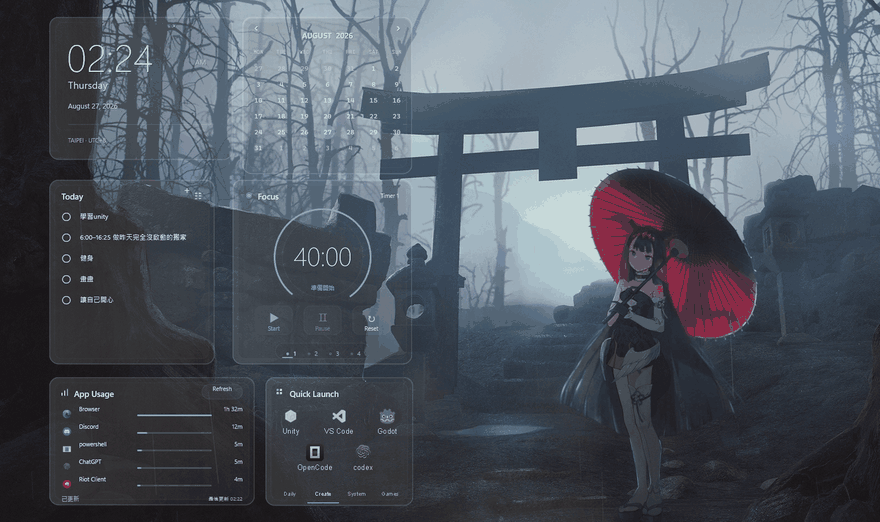

# TanaDaily Rainmeter Skins

一套 local-first、低權限的 Windows Rainmeter 桌面工作台。介面採 neutral white / smoke gray frosted glass，讓桌布保留為主要色彩來源。

## 動態預覽

## 功能

- Clock 與 Monthly Calendar
- Markdown Todo：直接勾選、以面板新增任務，安全寫回 UTF-8 BOM `tasks.md`
- Focus：4 個可同時運作、可命名與自訂時間的 timestamp timer，完成時播放 Windows 提示音
- App Usage：選配 ActivityWatch，本機 `localhost:5600` 唯讀彙整，離線時保留最後成功資料
- Quick Launch：最多 4 類、每類 5 格，分類名稱與捷徑皆可在圖形面板設定
- 所有卡片使用 Rainmeter `On Desktop` 層級，不會覆蓋一般應用程式

## 安裝

需求：Windows 10/11、Rainmeter 4.5 或更新版本。

1. 從 [`dist`](dist/) 下載最新版 `.rmskin`。
2. 雙擊檔案，使用 Rainmeter Skin Installer 安裝。
3. 安裝後會載入 `MistRainWorkbench\MainDashboard.ini`，並將六張卡片放到預設位置。

也可將 [`src/Skins/MistRainWorkbench`](src/Skins/MistRainWorkbench/) 複製到 Rainmeter 的 `Skins` 資料夾後 Refresh all。

## 建議搭配 ActivityWatch

若要使用 **App Usage**，建議安裝 [ActivityWatch 官方 Windows Installer](https://activitywatch.net/downloads/)（下載頁面中的 stable / Installer recommended）。

1. 安裝並啟動 ActivityWatch。
2. 建議讓 ActivityWatch 隨 Windows 自動啟動，才能持續累積完整紀錄。
3. 保持預設本機服務位址 `http://localhost:5600`；Dashboard 會自動讀取，不需要帳號、OAuth 或雲端連線。

ActivityWatch 仍是選配；未安裝或暫時未執行時，App Usage 只會顯示離線狀態，不影響其他 widget。

## 使用與設定

- Todo 資料位於 `MistRainWorkbench\@Resources\Data\tasks.md`。寫入採 hash conflict protection、同目錄暫存檔、驗證、atomic replace，並保留 `.bak`。
- Todo 的 `+` 會開啟 Rainmeter 內的輸入面板，不顯示 CMD / PowerShell 視窗。
- Focus 底部 1–4 是四個獨立計時器。左鍵切換，右鍵編輯名稱與分鐘。
- Quick Launch 底部分類可切換；右鍵分類可改名。點空格可新增，既有格左鍵開啟、右鍵編輯；清除需在同一設定面板內再次確認。
- 若要更換 Todo 外部編輯器，可修改 `@Resources\Variables.inc` 的 `TasksEditorCommand`。
- ActivityWatch 預設每 5 分鐘更新一次，API 失敗時保留最後成功資料。

## 隱私與安全

- 不含 OAuth、雲端 API、遙測或遠端帳號整合。
- ActivityWatch 只讀取使用者電腦上的本機 API。
- 發佈包不包含作者的 tasks、使用紀錄、計時狀態或個人捷徑。
- PowerShell / Lua 原始碼全部隨包提供，可直接稽核；`.rmskin` 未做程式碼簽章。

詳細測試結果見 [TESTING.md](TESTING.md)。English documentation: [README.en.md](README.en.md)。

## License

[MIT](LICENSE)
